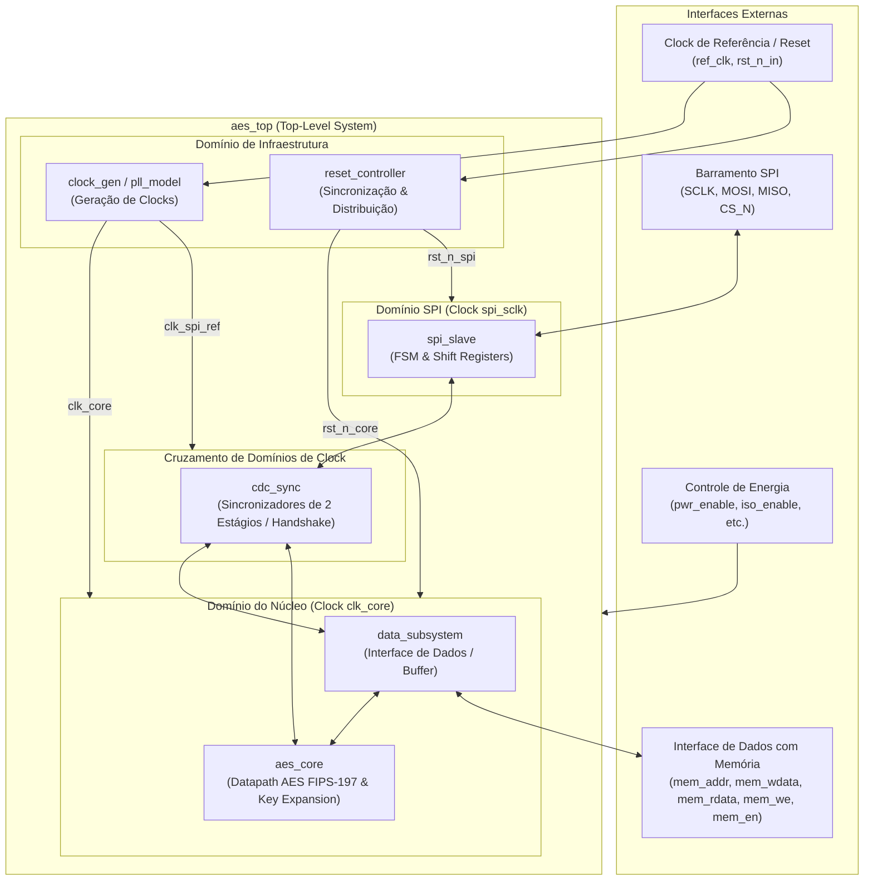

# Especificação de Arquitetura: AES Top-Level System

**Projeto:** Acelerador AES com interface SPI e baixo consumo  
**Documento:** Especificação Arquitetural de Referência  
**Versão:** 1.0 (Esqueleto Inicial)  

---

## 1. Visão Geral da Arquitetura

O sistema de topo (*AES Top-Level System*) consiste em um acelerador de hardware para criptografia e decriptografia AES conectado a um microprocessador mestre via barramento serial **SPI**, com interface de acesso direto a dados por memória e suporte nativo a técnicas de gerenciamento de energia e múltiplos domínios de clock.

---

## 2. Descrição dos Submódulos

### 2.1 `reset_controller.sv`
- **Função:** Capturar a entrada externa assíncrona de reset (`rst_n_in`) e gerar resets limpos, assíncronos na asserção e síncronos na liberação (*asynchronous assert, synchronous deassert*) para cada domínio de clock (`rst_n_core`, `rst_n_spi`).
- **Benefício:** Evita metaestabilidade nos flip-flops na saída de reset.

### 2.2 `clock_gen.sv`
- **Função:** Emular o modelo de PLL de silício, recebendo um clock de referência (`ref_clk`) e gerando o clock principal do acelerador (`clk_core`) e os relógios de amostragem necessários.
- **Clock Gating:** Suporte à inserção de células de clock gating para desabilitar o chaveamento em períodos de ociosidade do acelerador.

### 2.3 `spi_slave.sv`
- **Função:** Implementar o periférico SPI em Modo 0 (CPOL=0, CPHA=0). Decodifica comandos de leitura e escrita vindos do mestre externo, carrega chaves, configurações operacionais e transmite status de conclusão.
- **Portas:** `spi_sclk`, `spi_cs_n`, `spi_mosi`, `spi_miso`.

### 2.4 `cdc_sync.sv`
- **Função:** Fornecer sincronizadores robustos de múltiplos estágios (2-flop/3-flop) e protocolos de handshake de pulso/nível para transferir dados e sinais de disparo entre o domínio de clock SPI e o domínio de clock do Core sem risco de metaestabilidade.

### 2.5 `data_subsystem.sv`
- **Função:** Gerenciar a interface de entrada e saída de dados com a memória (SRAM ou barramento de dados), alimentando blocos de 128 bits para o motor AES e armazenando os dados processados de volta.
- **Portas com Memória:** `mem_addr`, `mem_wdata`, `mem_rdata`, `mem_we`, `mem_en`.

### 2.6 `aes_core.sv`
- **Função:** Datapath principal que implementa as transformações criptográficas definidas pelo NIST FIPS-197:
  - `SubBytes` / `InvSubBytes` (S-Box)
  - `ShiftRows` / `InvShiftRows`
  - `MixColumns` / `InvMixColumns`
  - `AddRoundKey`
  - Algoritmo de expansão de chaves (*Key Expansion*).

---

## 3. Domínios de Potência e Intenção de Energia (UPF)

A arquitetura prevê dois domínios principais de potência na etapa de baixo consumo (Fases 5 e 6):
1. **`PD_AON` (Always-On Domain):**
   - Contém os módulos de infraestrutura (`reset_controller`, `clock_gen`) e a interface de comunicação básica (`spi_slave`).
   - Permanece alimentado para responder a comandos de inicialização e acordar o núcleo (*wake-up*).
2. **`PD_AES` (Switchable Power Domain):**
   - Contém o núcleo do acelerador (`aes_core`) e buffers associados.
   - Pode ser desligado via *Power Gating* por células de corte (power switches) quando inativo.
   - Sinais que cruzam de `PD_AES` para `PD_AON` são isolados por células de isolamento (`ISO`) durante o desligamento para evitar curto-circuito e nós flutuantes.
