# Backlog do Projeto — Acelerador AES com Interface SPI e Baixo Consumo

**Trilha:** RTL Design Track  
**Duração:** 15 Semanas  
**Ritmo:** 1 Entregável por Semana com Sabatina e Relatório Semanal  
**Branch Principal:** `main` | **Branches de Trabalho:** `wXX-[funcionalidade]`  

---

## Visão Geral das Fases

```mermaid
gantt
    title Cronograma de Execução do IP AES (15 Semanas)
    dateFormat  X
    axisFormat Sem %s
    section Fase 1: Arquitetura
    Semana 1 - Kick-off & Ambiente    :active, 1, 2
    Semana 2 - Arquitetura & CDC       : 2, 3
    section Fase 2: RTL
    Semana 3 - SPI Slave & Registradores : 3, 4
    Semana 4 - Reset, Clock & CDC       : 4, 5
    Semana 5 - Datapath AES & Memória   : 5, 6
    Semana 6 - Integração & Handover DV : 6, 7
    section Fase 3: Síntese
    Semana 7 - Síntese Lógica & Baseline : 7, 8
    section Fase 4: Formal
    Semana 8 - Setup Formality          : 8, 9
    Semana 9 - Fechamento Formal         : 9, 10
    section Fase 5: UPF
    Semana 10 - Arquitetura de Potência : 10, 11
    Semana 11 - Intenção de Potência UPF: 11, 12
    section Fase 6: Baixo Consumo
    Semana 12 - Clock Gating & Síntese LP: 12, 13
    Semana 13 - Power Gating & Retenção : 13, 14
    Semana 14 - Comparação com Baseline : 14, 15
    section Fase 7: Encerramento
    Semana 15 - Documentação & Apresentação: 15, 16
```

---

## Detalhamento Semana a Semana

### Fase 1: Especificação e Arquitetura (Semanas 1–2)

#### Semana 1 — Kick-off, Estudo e Ambiente
- [x] Apresentação do projeto e alinhamento de escopo.
- [x] Estudo do algoritmo AES (FIPS-197) e protocolo SPI (CPOL, CPHA).
- [x] Estruturação da árvore de pastas e arquivos base (`rtl`, `sim`, `synth`, `formal`, `upf`, `docs`, `scripts`).
- [x] Criação do backlog inicial do projeto e template de relatório semanal.
- [x] Ambiente de execução com exemplo mínimo (compilação, lint e simulação smoke test).
- **Entregável:** Repositório estruturado, backlog inicial, smoke test rodando e relatório `docs/reports/semana_01.md`.
- **Critério de Aceite:** Repositório clonável em ambiente limpo e execução com um único comando (`make`).

#### Semana 2 — Especificação Microarquitetural e Mapa de Registradores
- [ ] Especificação detalhada da microarquitetura dos submódulos.
- [ ] Mapeamento dos registradores de controle e status (CSRs) via interface SPI.
- [ ] Definição do protocolo de interface de dados com a memória (barramento SRAM/FIFO).
- [ ] Estratégia de cruze de domínios de clock (CDC) entre `spi_sclk` e `clk_core`.
- **Entregável:** Documento de microarquitetura (`docs/architecture.md`) completo e revisado pelo verificador parceiro.
- **Critério de Aceite:** Interfaces aprovadas sem ambiguidades para a equipe de DV.

---

### Fase 2: Desenvolvimento do RTL (Semanas 3–6)

#### Semana 3 — Interface SPI Slave e Bloco CSR
- [ ] Implementação da FSM receptora/transmissora da SPI (Modo 0, shift registers MOSI/MISO).
- [ ] Implementação do banco de registradores de configuração, chaves e controle de operação.
- [ ] Testbench dedicado do módulo SPI e validação unitária.
- **Entregável:** Código RTL sintetizável do `spi_slave.sv` e relatório `docs/reports/semana_03.md`.
- **Critério de Aceite:** Testes de escrita e leitura de registradores via SPI passando com 100% de acerto.

#### Semana 4 — Gerador de Clock, Reset e CDC
- [ ] Implementação do `reset_controller.sv` com sincronizador assíncrono / liberação síncrona.
- [ ] Modelo comportamental e divisor/selecionador de clock (`clock_gen.sv` / PLL model).
- [ ] Implementação e validação de células sincronizadoras de CDC (`cdc_sync.sv`).
- **Entregável:** RTL de infraestrutura de clock/reset e sincronizadores validados em simulação.
- **Critério de Aceite:** Ausência de glitches de reset e sinais sincronizados corretamente entre domínios.

#### Semana 5 — Datapath AES e Subsistema de Dados
- [ ] Implementação dos blocos fundamentais do AES (SubBytes / S-Box, ShiftRows, MixColumns, AddRoundKey).
- [ ] FSM de controle das 10 rodadas e expansão de chave *on-the-fly* ou pré-armazenada.
- [ ] Lógica de interface de memória / buffer de dados (`data_subsystem.sv`).
- **Entregável:** RTL do `aes_core.sv` e `data_subsystem.sv` validados individualmente com vetores NIST.
- **Critério de Aceite:** Criptografia de bloco teste (NIST SP 800-38A) com vetor de teste batendo o padrão ouro.

#### Semana 6 — Integração do Sistema de Topo e Entrega DV (Milestone RTL v1.0)
- [ ] Interconexão de todos os blocos no topo `aes_top.sv`.
- [ ] Simulação de ponta a ponta: envio de chave e dados por SPI/memória, disparo de criptografia e leitura do resultado.
- [ ] Checagem de lint estrito (`+lint=all`) sem violações pendentes.
- [ ] Geração da tag `w06-rtl-v1.0` e abertura do canal de issues com o verificador parceiro.
- **Entregável:** Tag Git `w06-rtl-v1.0`, repositório limpo e relatório de integração `docs/reports/semana_06.md`.
- **Critério de Aceite:** Simulação de ponta a ponta aprovada e entrega formalizada ao parceiro de DV.

---

### Fase 3: Síntese Inicial (Semana 7)

#### Semana 7 — Síntese Lógica e Baseline
- [ ] Elaboração do arquivo de restrições de temporização (`aes_top.sdc`) com múltiplos clocks.
- [ ] Script de síntese lógica com Synopsys Design Compiler (`synth.tcl`) na biblioteca alvo SAED32.
- [ ] Análise de relatórios de área, timing (setup/hold slack) e consumo de potência inicial.
- **Entregável:** Netlist sintetizada inicial, relatórios de síntese e relatório `docs/reports/semana_07.md`.
- **Critério de Aceite:** Design compilado sem violações graves de timing (slack positivo) e baseline registrado.

---

### Fase 4: Verificação Formal de Equivalência (Semanas 8–9)

#### Semana 8 — Configuração e Execução do Synopsys Formality
- [ ] Criação do script de equivalência formal (`formality.tcl`) comparando RTL contra Netlist.
- [ ] Mapeamento de pontos de comparação (registers, ports, black-boxes).
- **Entregável:** Script funcional do Formality e primeiro relatório de equivalência.
- **Critério de Aceite:** Mapeamento de 100% dos pontos de comparação sem falhas estruturais.

#### Semana 9 — Fechamento e Comprovação de Equivalência Formal
- [ ] Resolução de divergências de otimização de síntese (retiming, clock gating, hierarquia).
- [ ] Geração do relatório oficial de verificação formal comprovando status `Equivalent`.
- **Entregável:** Relatório de fechamento formal com status `SUCCESS: Equivalent`.
- **Critério de Aceite:** 100% de equivalência comprovada matematicamente entre RTL e Netlist.

---

### Fase 5: Intenção de Potência (Semanas 10–11)

#### Semana 10 — Arquitetura de Energia e Domínios de Potência
- [ ] Definição dos domínios de potência (Always-On Domain, AES Datapath Power Domain).
- [ ] Especificação dos estados de energia (Active, Sleep, Power-Gated).
- [ ] Definição de estratégia de isolamento de sinais e retenção de chave/estado.
- **Entregável:** Documento de arquitetura de potência e tabela de estados (Power State Table - PST).
- **Critério de Aceite:** Arquitetura de potência alinhada com as capacidades do PDK SAED32.

#### Semana 11 — Modelagem em UPF (IEEE 1801)
- [ ] Criação do arquivo `aes_top.upf` com declaração de supply ports, supply nets, power switches.
- [ ] Configuração de estratégias de isolamento (`set_isolation`) e retenção (`set_retention`).
- [ ] Checagem de sintaxe e consistência de UPF pré-síntese.
- **Entregável:** Arquivo UPF funcional e relatório de validação sintática.
- **Critério de Aceite:** Validação de consistência do UPF aprovada sem erros.

---

### Fase 6: Técnicas de Baixo Consumo (Semanas 12–14)

#### Semana 12 — Clock Gating e Síntese Ciente de Potência
- [ ] Habilitação de inserção automática de clock gating pelo Design Compiler (`compile_ultra -gate_clock`).
- [ ] Inserção de clock gating estrutural em blocos ociosos do datapath.
- [ ] Análise da redução de potência dinâmica.
- **Entregável:** Netlist com clock gating e relatórios comparativos de potência.
- **Critério de Aceite:** Redução comprovada na potência dinâmica em relação ao baseline da Semana 7.

#### Semana 13 — Power Gating, Isolamento e Retenção
- [ ] Síntese lógica orientada a UPF (LP synthesis).
- [ ] Inserção de células de corte de energia (Power Switches), isoladores e registradores de retenção.
- [ ] Simulação funcional do ciclo de Power-Down, Retenção e Power-Up (Wake-up).
- **Entregável:** Netlist com domínios chaveados e relatório funcional do ciclo de potência.
- **Critério de Aceite:** Circuito desliga o domínio AES e retoma com dados preservados nos registradores de retenção.

#### Semana 14 — Análise Comparativa e Avaliação de Trade-offs
- [ ] Comparação rigorosa das métricas finais vs. Baseline (Semana 7):
  - Consumo Estático (Leakage);
  - Consumo Dinâmico (Switching);
  - Área total de silício (overhead de switches e células LP);
  - Frequência máxima de operação.
- **Entregável:** Tabela consolidada de métricas e relatório de tradeoffs `docs/reports/semana_14.md`.
- **Critério de Aceite:** Justificativa quantitativa dos ganhos de eficiência energética obtidos.

---

### Fase 7: Encerramento (Semana 15)

#### Semana 15 — Apresentação Técnica e Artigo Final
- [ ] Consolidação de toda a documentação técnica do IP.
- [ ] Elaboração de slides para apresentação final perante banca/instrutor.
- [ ] Redação do artigo/relatório executivo final descrevendo desafios, métricas e resultados.
- **Entregável:** Relatório final consolidado, slides de apresentação e tag de release final `v1.0-final`.
- **Critério de Aceite:** Defesa oral aprovada com êxito na sabatina do projeto.
